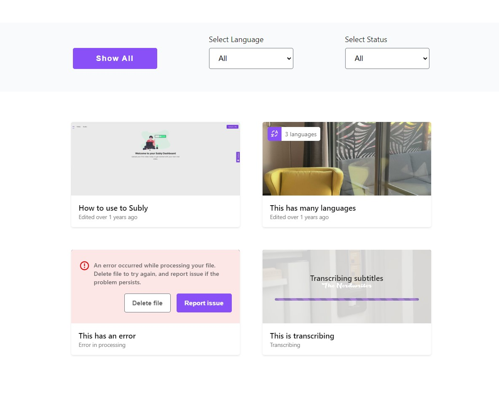

# Subly Junior Front-End Developer Challenge

In this challenge, I'm building some React components, using React, TypeScript, and provided API to fetch data from as main requirements.

<p align='center'></p>

> For local setup
>
> ```bash
> // clone this repository
> 
> // install dependencies
>
>     npm install
>
> // run the app
>
>     npm start
> ```

## File Structure

    - `public`:
         `index.html`

    - `src`:
        - `components`:
            - (Related components)
        - `css`:
            - (Related css)
        - `utils`:
            - (Helper functions)
        - (Main files)

### Thinking and Working Process

- After reading the challenge description, the main challenge was to work with TypeScript, as I have no idea how to use it in the first place.
So the first step was to learn some essential TypeScript concepts, and how to use it with React.

- During the first step, I discovered the [SWR](https://swr.vercel.app/) library, so I decided to use it to fetch data from the API.

- The next step was to sketch out the components and the structure.

- To have some good references I made some research on the [Subly](https://www.getsubly.com/) website.

As you can expect, the most challenging part was to learn and use TypeScript considering the time, which effects the way I structure my code.
I would prefer to fetch the data in root component, but I faced some issues with it and did it in the main component instead.

The other challenge was deciding how to structure the files considering the project's size, and if it was worth to create a `context` folder for global state, pages folder, and split the components into separate folders, but at end I decided to keep it simple and by having components, css and utils folders.

The last thing to mention is that I didn't use [React Router](https://reactrouter.com/), so instead having the main component in the page folder, I just keep it as a controller component in the components folder, and didn't use links in my components.

Unfortunately, the lack of time prevented me from creating some tests for the components.

This was my experience with the challenge, and I hope you will like it.
